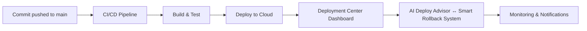

# 🧱 Nora AI – Systemarkitektur

**Dato:** 2025-01-21  
**Status:** High-Level Architecture Documentation

---

## 🔄 DEPLOYMENT PIPELINE



Systemet er modulært, AI-drevet og bygd for full automasjon.

---

## 📊 SYSTEM ARCHITECTURE

### Component Diagram

```
┌─────────────────────────────────────────────────────────┐
│                    Nora AI Platform                      │
├─────────────────────────────────────────────────────────┤
│                                                           │
│  ┌──────────────┐         ┌──────────────┐            │
│  │  AI Engine   │─────────▶│  Agents      │            │
│  │  (Core)      │         │  (Multiple)  │            │
│  └──────┬───────┘         └──────────────┘            │
│         │                                                │
│  ┌──────▼───────┐         ┌──────────────┐            │
│  │  Memory      │─────────▶│  Knowledge   │            │
│  │  Engine      │         │  Base        │            │
│  └──────┬───────┘         └──────────────┘            │
│         │                                                │
│  ┌──────▼───────┐         ┌──────────────┐            │
│  │  API Layer   │─────────▶│  Clients     │            │
│  │  (REST)      │         │  (Multi-     │            │
│  └──────────────┘         │   tenant)    │            │
│                            └──────────────┘            │
└─────────────────────────────────────────────────────────┘
```

---

## 🔄 DEPLOYMENT ARCHITECTURE

### CI/CD Pipeline

```
Developer → Version Control → CI/CD Pipeline → Cloud Platform → Production
    │              │                │                │              │
    │              │                │                │              │
    └──────────────┴────────────────┴────────────────┴──────────────┘
                              │
                              ▼
                      Deployment Center
                      (Monitoring & Control)
```

---

## 🧠 AI AGENTS

### Agent Types

Systemet bruker flere spesialiserte AI-agenter for ulike oppgaver:

- **Financial Agent** - Economic advice and budget planning
- **Verge Agent** - Guardian support and assistance
- **Coach Agent** - Life coaching and motivation
- **Dev Agent** - Developer assistance
- **Marketer Agent** - Marketing support
- **System-Architect Agent** - System design
- **General Agent** - Universal AI assistant

---

## 📊 DATA FLOW

### Request Flow

```
Client Request → API Gateway → Agent Router → AI Engine → Response
                     │              │            │
                     │              │            │
                     ▼              ▼            ▼
                Authentication  Agent Selection  AI Processing
```

---

## 🔒 SECURITY ARCHITECTURE

### Security Layers

1. **Repository Security** - Private repository
2. **API Security** - API key authentication
3. **Data Security** - Encrypted storage
4. **Network Security** - HTTPS only
5. **Access Control** - Policy-based access control

---

## 📈 SCALABILITY

### Scaling Strategy

- **Horizontal Scaling** - Multiple instances
- **Database Scaling** - Read replicas
- **Caching** - Distributed cache
- **CDN** - Edge distribution
- **Load Balancing** - Automatic load balancing

---

**Programmert med ❤️ av Cato Hansen**  
**Copyright © 2025 Cato Hansen. All rights reserved.**
