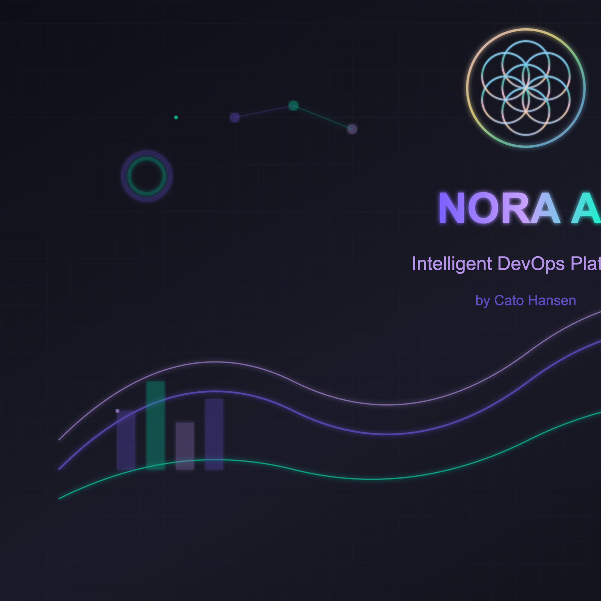

# 💠 NORA AI – Intelligent DevOps Platform

**⚙️ Proprietary Enterprise System – Showcase Edition**

> AI-drevet DevOps, sikkerhetsarkitektur og selvhelbredende infrastruktur.  
> Utviklet av **Cato Hansen**, System Architect & Founder.

---

## 🚀 Hva er Nora AI?

**Nora AI** er en autonom DevOps-plattform med innebygd AI-analyse, kontinuerlig distribusjon og selv-optimalisering.  

Systemet bygger, deployer, overvåker og forbedrer seg selv – alt i sanntid.

🧠 **AI Deploy Advisor** – analyserer endringer, vurderer risiko og anbefaler optimalt deploy-tidspunkt.  

🔁 **Smart Rollback System** – overvåker feil og utfører automatisk rollback ved kritiske problemer.  

📊 **Deployment Center** – sanntidsdashbord med grafer, logger, notifikasjoner og DevOps-analyse.  

🔒 **Security Layer** – full beskyttelse med proprietary-lisens, secrets-håndtering og audit-logging.

---

## 🧱 Arkitektur

- **Frontend:** Next.js 14 (App Router)  
- **Backend:** Edge Functions / API Routes  
- **Database:** PostgreSQL (Neon / Prisma ORM)  
- **CI/CD:** GitHub Actions → Vercel Deploy  
- **Security:** Proprietary license, token-isolasjon, access-kontroll  
- **AI:** LangGraph / Custom logic (Deploy Advisor & Rollback Intelligence)

Se detaljer: [ARCHITECTURE.md](ARCHITECTURE.md)

---

## 🧩 Hovedfunksjoner

| Funksjon | Beskrivelse |
|-----------|-------------|
| **AI Deploy Advisor** | Prediktiv analyse og anbefalt deploy-tidspunkt |
| **Smart Rollback** | Automatisk rollback ved feil over terskel |
| **Deployment Center** | Full oversikt over status, metrics og historikk |
| **Metrics & Insights** | Realtime data om byggetid, suksessrate, risiko |
| **Security System** | PROPRIETARY-beskyttelse og secrets-håndtering |
| **Automatisk Deployment** | Push → Build → Deploy → Monitor |

Se full oversikt: [FEATURES.md](FEATURES.md)

---

## 🔒 Sikkerhet og lisens

Dette repoet er kun for **presentasjonsformål**.  

Ingen kildekode fra det private systemet er inkludert.  

All programvare tilhører **© 2025 Cato Hansen.**

📜 Lisens: [LICENSE](LICENSE)

---

## 👨‍💻 Om utvikleren

**Cato Hansen** – System Architect & Founder  

- AI & Systemutvikling (Next.js, LangGraph, DevOps)  
- 15+ års erfaring innen teknologi og systemarkitektur  
- CEO – *Hansen Global Solutions / Hansen AI Systems*  
- 🌐 [www.catohansen.no](https://www.catohansen.no)

**Kontakt:** cato@catohansen.no

---

## 📈 Status

| Komponent | Status |
|------------|--------|
| Private Core Repo | 🔒 `catohansen/Nora-AI` |
| Showcase Repo | 🌍 `catohansen/Nora-AI-Showcase` |
| CI/CD Pipeline | ✅ Automatisk |
| AI Integration | 🤖 Aktiv |
| Security | 🛡️ Proprietary |

---

## 🪄 Visjon

> Nora AI skal bli en **selvtenkende DevOps-partner** som gir utviklere, selskaper og gründere total kontroll, trygghet og automasjon – uten kompleksitet.

---

## 📚 Dokumentasjon

- [ARCHITECTURE.md](ARCHITECTURE.md) – Systemarkitektur og teknisk oversikt
- [FEATURES.md](FEATURES.md) – Detaljert funksjonsoversikt
- [LICENSE](LICENSE) – Showcase License

---

**Programmert med ❤️ av Cato Hansen**  
**Copyright © 2025 Cato Hansen. All rights reserved.**
